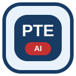
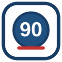

# IPT Brisbane — PTE Scoring Emoji Pack

Custom 128×128 SVG emoji/reaction assets for the PTE scoring portal.

## Brand source

This pack follows the brand tokens already defined in `public/ipt-tokens.css`:

- IPT Blue 900: `#173B63`
- IPT Blue 700: `#205080`
- IPT Blue 100: `#E9F2FA`
- IPT Red 600: `#C53030`
- Ink: `#18202A`
- White: `#FFFFFF`

The shapes are deliberately simple and high-contrast so they remain readable at small sizes.

## Included reactions

| Emoji | Suggested shortcode | Intended use |
|---|---|---|
|  | `:ipt:` | IPT Brisbane |
|  | `:pte_ai:` | PTE AI practice |
|  | `:score90:` | Excellent score |
|  | `:swt:` | Summarize Written Text |
|  | `:essay:` | Essay practice |
|  | `:speaking:` | Speaking |
|  | `:reading:` | Reading |
|  | `:listening:` | Listening |
|  | `:pronunciation:` | Pronunciation feedback |
|  | `:fluency:` | Oral fluency feedback |
|  | `:grammar:` | Grammar feedback |
|  | `:vocab:` | Vocabulary feedback |
|  | `:mock_test:` | Mock tests |
|  | `:progress:` | Student progress |
|  | `:teacher_feedback:` | Teacher comments |
|  | `:ai_score:` | AI scoring complete |
|  | `:celebrate:` | Achievement |

Open `preview.html` in a browser to view the whole set.
